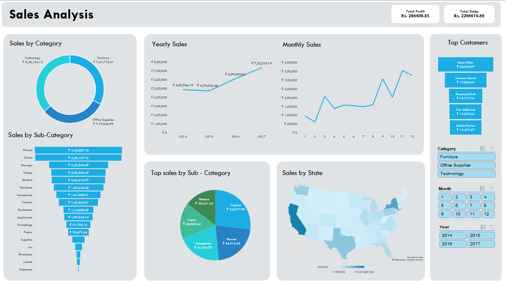

# 📊 Sales Analysis Dashboard (Excel)

## 📌 Project Overview
This project is an **interactive Sales Analysis Dashboard** created using **Microsoft Excel**.  
The dashboard provides a clear and data-driven view of sales performance across categories, sub-categories, customers, time periods, and regions.

It is designed to help stakeholders understand business trends, identify top-performing segments, and make informed decisions.

---

## 🎯 Objectives
- Analyze overall sales and profit performance  
- Identify top-performing product categories and sub-categories  
- Track monthly and yearly sales trends  
- Highlight top customers by sales  
- Visualize regional sales distribution  

---

## 🛠 Tools & Technologies
- Microsoft Excel  
- Pivot Tables  
- Pivot Charts  
- Slicers  
- Excel Formulas  
- Conditional Formatting  
- Data Visualization  

---

## 📈 Dashboard Features

### 🔹 Key Performance Indicators (KPIs)
- **Total Sales**
- **Total Profit**

### 🔹 Sales Breakdown
- Sales by Category (Technology, Furniture, Office Supplies)
- Sales by Sub-Category (Phones, Chairs, Storage, Tables, etc.)

### 🔹 Trend Analysis
- Yearly Sales Trend
- Monthly Sales Trend

### 🔹 Customer Insights
- Top Customers based on total sales

### 🔹 Geographic Analysis
- Sales by State using Map Visualization

### 🔹 Interactive Filters
- Category filter  
- Month filter  
- Year filter  

---

## 🧩 Key Insights
- Technology category generates the highest revenue  
- Phones and Chairs are the top-selling sub-categories  
- Monthly sales show seasonal patterns  
- A small number of customers contribute significantly to total sales  
- Certain states outperform others in terms of sales volume  

---

## 📸 Dashboard Preview

---

## ⭐ Feedback
If you find this project helpful, feel free to give it a ⭐ and share your feedback!
